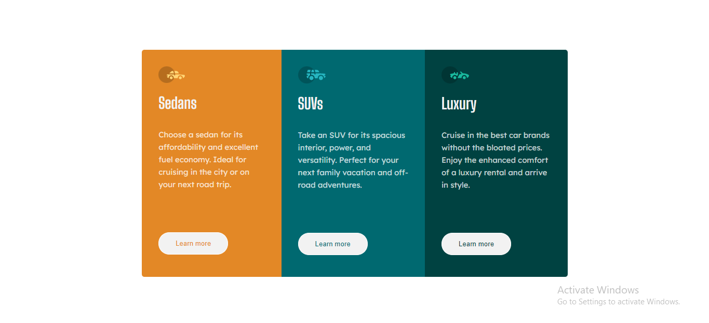

# Frontend Mentor - 3-column preview card component solution

This is a solution to the [3-column preview card component challenge on Frontend Mentor](https://www.frontendmentor.io/challenges/3column-preview-card-component-pH92eAR2-). Frontend Mentor challenges help you improve your coding skills by building realistic projects. 

## Table of contents

- [Overview](#overview)
  - [The challenge](#the-challenge)
  - [Screenshot](#screenshot)
  - [Links](#links)
- [My process](#my-process)
  - [Built with](#built-with)
  - [What I learned](#what-i-learned)
  - [Continued development](#continued-development)
  - [Useful resources](#useful-resources)
- [Author](#author)
- [Acknowledgments](#acknowledgments)

**Note: Delete this note and update the table of contents based on what sections you keep.**

## Overview

### The challenge

Users should be able to:

- View the optimal layout depending on their device's screen size
- See hover states for interactive elements

### Screenshot




### Links

- Solution URL: [View solution here](https://github.com/DanglingGem/3-column-preview-card-component.git)
- Live Site URL: [View Live site here](https://danglinggem.github.io/3-column-preview-card-component/)

## My process

### Built with

- Semantic HTML5 markup
- CSS custom properties
- Flexbox


### What I learned

Better simpler codes for styling.


```css
.hero-container{
    display: flex;
    margin: auto;
    height: 70vh;
    width: 60%;
    position: relative;
    top: 6rem;
    text-align: center;
    border-radius: 5px;

}

```


### Continued development

To learn Mobile-first method of coding.


## Author


- Frontend Mentor - [@DanglingGem](https://www.frontendmentor.io/profile/DanglingGem)
- Twitter - [@danglinggem](https://www.twitter.com/danglinggem)


## Acknowledgments

I will like to use this opportunity to appreciate Frontendmentor.io for creating this amazing platform to help frontend web developers grow. Thank you!


